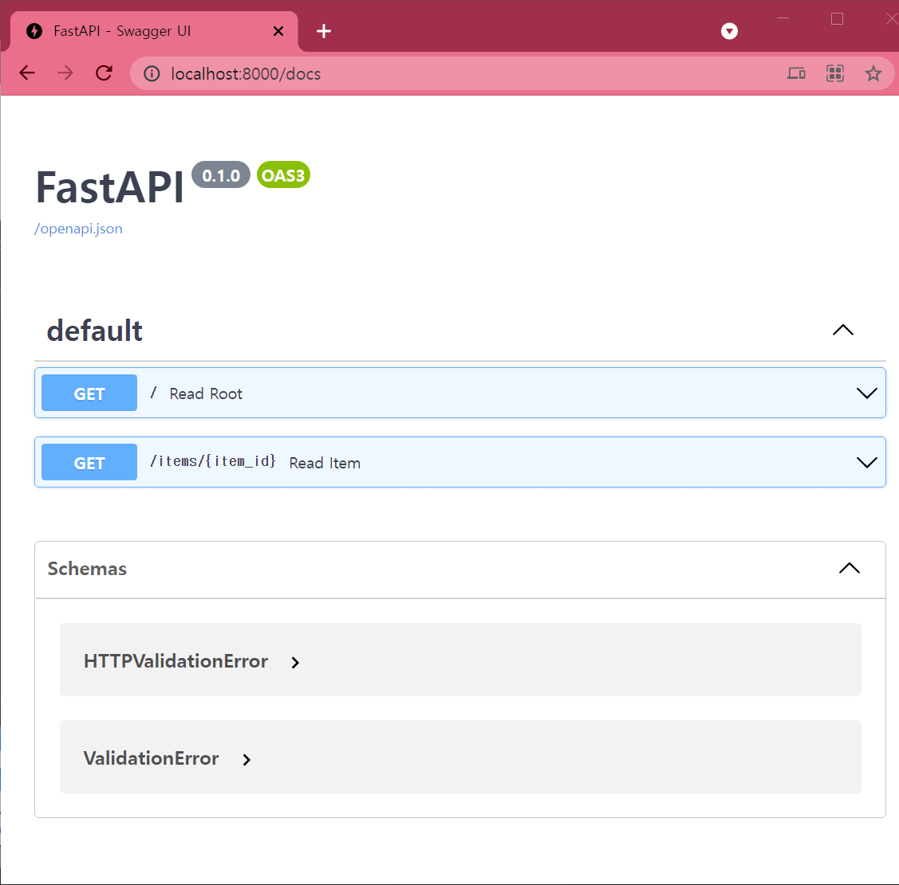

# fastapi simple example

기록용입니당

## 출처
https://github.com/hogeline/sample_fastapi

## install
```python
pip install fastapi
pip install uvicorn[standard]
```

## run
```python
uvicorn main:app --reload
```

## docker
```cmd
docker-compose up -d
```

http://localhost:8000/docs

